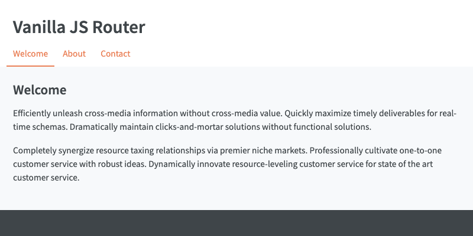

# Vanilla JS Router

Example of a simple router in JavaScript.

## How to run

This project can be run with <code>live-server</code>. To install live server, run:

<pre>
npm install -g live-server
</pre>

Then run the following in the project directory:

<pre>
live-server --port=1234
</pre>

To preview, navigate to:

<pre>
http://127.0.0.1:1234/
</pre>

## File structure and customization

### App layout

<strong>index.html</strong>

Here you can edit the overall app layout and add/remove navigation links.
The navigation links have to have CSS class <code>'router-link'</code> in
order for the router to function.

For example, the link to 'about' route is:

<pre>
&lt;nav class="nav">
  &lt;ul>
    ...
    &lt;li>&lt;a class="router-link" href="about">About&lt;/a>&lt;/li>
    ...
  &lt;/ul>
&lt;/nav>
</pre>

Whenever the app route changes, page templates are loaded into the element
with <code>id="root"</code>:

<pre>
&lt;main id="root" class="main">
&lt;/main>
</pre>

### Page templates

<strong>scripts/templates/</strong>

Page templates can be modified or added here, then imported into
<code>scripts/modules/router.js</code>.

For example, the 'about' page template in <code>scripts/templates/about.js</code>
currently contains:

<pre>
export default class About {
  static get template() {
    return `
  &lt;h2 class="title">About&lt;/h2>
  ...
  `;
  }
}
</pre>

It is then imported in <code>scripts/modules/router.js</code>:

<pre>
import About from '../templates/about.js';
</pre>

### Router

<strong>scripts/modules/router.js</strong>

The majority of the router logic is located here. You can specify new routes
and their corresponding templates in the <code>routes</code> array.

For example, the route 'about' is specified as follows:

<pre>
static routes = [
  ...
  new Route({
    path: 'about',
    title: 'About',
    template: About.template,
  }),
  ...
];
</pre>

(Router link click and browser history back/forward button click handlers
are here as well.)
